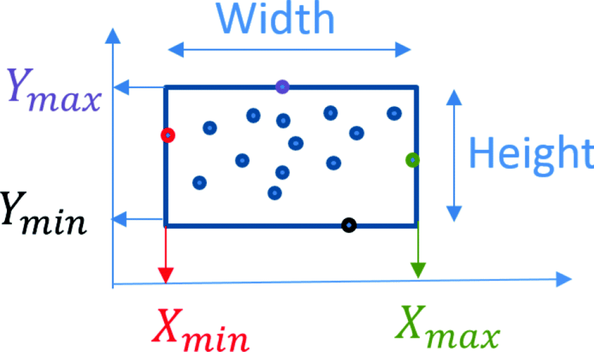
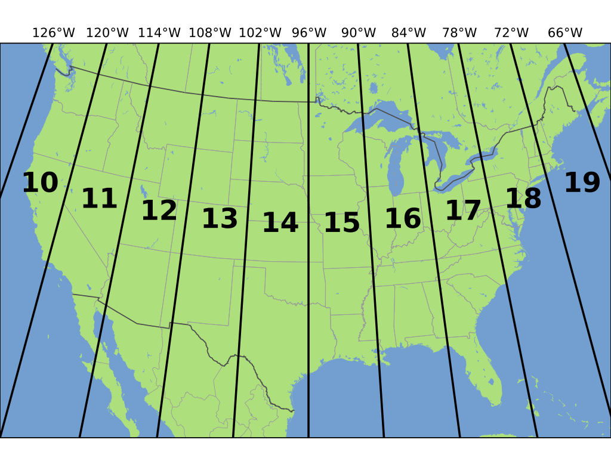

```{r setup, include=FALSE}
knitr::opts_chunk$set(echo = TRUE)
```

## Introduction to SF

This markdown document is a gentle introduction to the `{sf}` package. The intent is not to be exhaustive, but to demonstrate:

-   How using `{sf}` allows us to do typical GIS operations within R
-   Specific aspects of `{sf}` that are used often in the MUSA 508 assignments

Other fantastic resources include:

-   The [TOD Intro](https://urbanspatial.github.io/PublicPolicyAnalytics/TOD.html#setup) from the course text (Public Policy Analytics)
-   The ['sf' package documentation](https://r-spatial.github.io/sf/index.html)
-   Kyle Walker's {tidycensus} [documentation on spatial](https://walker-data.com/tidycensus/articles/spatial-data.html)
-   and many other intro to `{sf}` that are out there.

This exercise will pick up where the Week 1 `{tidycensus}` left off; loading census data using `geometry = TRUE` to result in an `{sf}` object.

## Package Setup

```{r setup_package, warning = FALSE, message = FALSE}
library(tidyverse)
library(tidycensus)
library(sf)
library(tmap) # mapping, install if you don't have it
set.seed(717)
```

Your Census API key should be loaded from the week 1 exercise. If you get an API error about the key, go back and look at the Week 1 markdown.

## Recap: Get ACS Data using `{tidycensus}`

We will use the same ACS variables as in the last exercise. The object called `acs_vars` is used to keep the variables we are interested in. Also, we will focus on specific tracts in the Mt. Airy neighborhood. Finally, we fetch the data using the `get_acs()` function. The code below is the same code used at the end of Week \#1 with the exception of removing the last line calling `st_as_af()` . We'll discuss why later.

```{r acs_vars, cache = FALSE, message = FALSE, warning = FALSE, results=FALSE}
acs_vars <- c("B01001_001E", # ACS total Pop estimate
              "B25002_001E", # Estimate of total housing units
              "B25002_003E", # Number of vacant housing units
              "B19013_001E", # Median HH Income ($)
              "B02001_002E", # People describing themselves as "white alone"
              "B06009_006E") # Total graduate or professional degree

myTracts <- c("42101023500", 
              "42101023600", 
              "42101023700", 
              "42101025300", 
              "42101025400",
              "42101025500", 
              "42101025600", 
              "42101038800")

acsTractsPHL.2016.sf <- get_acs(geography = "tract",
                             year = 2016, 
                             variables = acs_vars, 
                             geometry = TRUE, 
                             state = "PA", 
                             county = "Philadelphia", 
                             output = "wide") %>% 
  dplyr::select (GEOID, NAME, all_of(acs_vars)) %>%
  rename (total_pop.2016 = B01001_001E,
          total_HU.2016 = B25002_001E,
          total_vacant.2016 = B25002_003E,
          med_HH_Income.2016 = B19013_001E,
          total_White.2016 = B02001_002E,
          total_GradDeg.2016 = B06009_006E) %>%
  mutate(vacancyPct.2016 = total_vacant.2016/total_HU.2016,
         pctWhite.2016 = total_White.2016/total_pop.2016) %>%
  mutate(mtAiry = ifelse(GEOID %in% myTracts, "MT AIRY", "REST OF PHILADELPHIA"))
```

```{r ggplot_geom_sf, warning = FALSE, echo = FALSE}
ggplot()+
  geom_sf(data = acsTractsPHL.2016.sf, aes(fill = pctWhite.2016),
          color = "transparent")+
  geom_sf(data = acsTractsPHL.2016.sf %>%
            filter(mtAiry == "MT AIRY") %>%
            st_union(),
          color = "white",
          fill = "transparent")+
  labs(
    title = "Percentage of those identifying as 'white only' by tract",
    subtitle = "",
    caption = "Data: US Census Bureau, ACS 5-year estimates")
  
```

## `{sf}` and why spatial is special

There are two important additions in the above code that allow us to go from tabular data to spatial data. This is incredibly powerful because once data has a spatial component, it opens up a whole new world (pun intended!) of analytical possibilities. Instead of only analyzing how the variables are correlated, we can now measure how they are correlated over space, how near, how far, how clustered or dispersed. We have access to analyzing the entire spatial system that led to these data being what they are. To quote the Tobler's First Law of Geography, "*everything is related to everything else, but near things are more related than distant things.*" [wikipedia](https://en.wikipedia.org/wiki/Tobler%27s_first_law_of_geography). The rest of this semester will be using spatial relations to better understand data for more effective public policy.

To understand how the `{sf}` helps us do that, we will break it down using the `acsTractsPHL.2016.sf` object we just created from `{tidycensus}`. Compared to fetching tabular data, the one new addition to that code is:

-   the `geometry = TRUE` argument in the call to `get_acs()`

### Returning geometry

Using the `geometry = TRUE` argument in the `get_acs()` function does a lot of work for us. That argument tells the `{sf}` package to call on the `{tigris}` package to download a spatial data (think about a shapefile) from the U.S. [Tiger/Line](https://www.census.gov/geographies/mapping-files/time-series/geo/tiger-line-file.html) for the level of detail requested (e.g. state, county, tract, etc...), join the tabular ACS data to the geometry using the `GEOID` field, and then turn it into an `{sf}` object that R can use to map and analyze. Looking into the `acsTractsPHL.2016.sf` object, we can understand this better.

```{r}
class(acsTractsPHL.2016.sf)
```

First, we can see what `class` the `acsTractsPHL.2016.sf` object is. It is class `sf` first and then `data.frame` second. This means that you can write R code to treat this as a spatial class, but that you can also do a lot of the things you would normally do with a `data.frame` to it as well. That is very handy!

If we print the `acsTractsPHL.2016.sf` object, it looks a lot like a table, but has some extra information at the top that it is an `{sf}` object and has attributes aside from the tabular data.

```{r}
head(acsTractsPHL.2016.sf,2)
```

You will notice new information at the top of the print out from the `acsTractsPHL.2016.sf$geometry` object. This includes:

-   Simple feature collection with 2 features and 11 fields
-   geometry type: MULTIPOLYGON
-   dimension: XY
-   bbox: xmin: -75.23584 ymin: 39.96507 xmax: -75.22407 ymax: 39.99188
-   geographic CRS: NAD83

The first line tells you that you have a "Simple feature" collection of a certain number of rows and columns. More on this later, but `sf` stands for "simple features". We only have 2 features here because I limited it to two in the code above to save room. The `geometry type` tell us that the data is represented as a polygon; an area represented by at least three sides. The could also be POINT or POLYLINE if there data were represented as points or lines. The `dimension` tells us how the data are measured. It will typically always be "XY" in our class. Next the `bbox` tells us what the bounding box is for these data. The bounding box is the smallest rectangle that can be drawn to fit all of the data points. The numbers tell us the coordinates of the sides of the bbox. From that we can figure out what the corners are as demonstrated below. The final bit of information is the `geographic CRS` which stands for coordinate reference system.

You noticed in the bbox line that the box is measured in some way, in this case it is familiar latitude and longitude. However, we can measure geographic space using thousands of different coordinate systems. This is a major theme in this course; **There are many different ways to measure things in space. Each method has trade offs. You will have to know the basic systems and how to move data between them.** You could spend an entire career learning about coordinate systems, but for this course, you will only need the basics. More on that below.

{width="507"}

### How does `{sf}` store geometry?

We just learned that an `sf` object contains spatial information in the form of coordinates. In the case of `acsTractsPHL.2016.sf`, the coordinates form polygons. To see how this is stored, we can look at the `geometry` column.

```{r}
acsTractsPHL.2016.sf$geometry
```

The `geometry` column is special column in an `sf` object that contains the spatial information. It is stored as plain human readable text: `MULTIPOLYGON (((-75.23536 39.96851, -75.2357 39…` The specific format of this text is the [Simple Features standard](https://r-spatial.github.io/sf/articles/sf1.html). This a widely used standard which means there are lots of resources about it and lots of tools/packages/software that implement it. It is also where the `{sf}` packages gets its name! In the example above, the `geometry` column says that the object is a Multipart Polygon and then lists out all of the coordinates in longitude and latitude. For very complex shapes like a coast line you can imagine that this column could contain millions of coordinates and become quite large! That will be a consideration during this course so keep it in mind.

If you look at what class the `geometry` column is, you can see that it is a class `"sfc_MULTIPOLYGON" "sfc"` . This is different from typical data.frame column classes such as `character` or `numeric`. The `sfc` in this special class means *simple features collection*.

```{r}
class(acsTractsPHL.2016.sf$geometry)
```

The `geometry` column as an `sfc` can stand on its own, be plotted and analyzed, but it isn't very interesting without the associated data. Adding the interesting data is exactly what the `geometry = TRUE` argument of `get_acs()` does for us. Putting it together, `data.frame` + `sfc` = `sf`!

### What about the Coordinates?

The rabbit hole of understanding coordinate reference systems is very deep. We will only go down to the first level, but here are the things you need to start out with:

-   all spatial data need a CRS, otherwise they cannot be measured in space and cannot be spatially analyzed.

-   you need to know, or figure out, the CRS for all of the spatial data you work with. It is not enough just to guess. You will need to figure it out through looking at data sources and mapping data to confirm

-   There are two main types of CRS, Projected and Unprojected (aka Geographic) coordinate systems. Projected Coordinate Systems (PCS) are how we map/project the round earth onto a flat map. Common examples of PCS are State Plane, UTM, and Mercator coordinate systems. Geographic Coordinate Systems (GCS) are how we located things on the round'ish earth. Common examples are WGS84, GRS80, and NAD83. Every PCS is based on a CGS, but a GCS can be mapped on its own.

-   The most common GCS is WGS84, also known as [`EPSG:4326`](https://epsg.io/4326) . This is a very common CRS and the default for many mapping applications and mapping libraries like `leaflet` . You will use it very often.

-   To measure the distance between things, use a PCS such as State Plane or UTM with units in meters or feet. Trying to measure distances in Lat/Lon and GCS will often be difficult because the length of a meter (or a foot) changes in a GCS as you move north or south from the equator. A typical pattern is to project the data into UTM or similar for a step in the analysis and then move back to `4326` for mapping and other uses.

-   Here are some good places to start on these topics [Geocomputation in R](https://geocompr.robinlovelace.net/reproj-geo-data.html#introduction-3), [ESRI Geographic vs. Projected Coordinate Systems](https://www.esri.com/arcgis-blog/products/arcgis-pro/mapping/gcs_vs_pcs/), and [Introduction to Spatial Analysis in R](https://mgimond.github.io/Spatial/chp09_0.html)

Below we will go over some basic ways into interact with the CRS in `{sf}`.

## Manipulating the CRS of an `sf` object

We saw that the `acsTractsPHL.2016.sf` object has a CRS of `NAD83` when we inspected it. This CRS was automatically set by `{tidycensus}` because it knows where the data comes from. This will not always be the case! A format with a shapefile that has CRS information in the metadata will likely assign properly, but if you load a CSV with point coordinates, `{sf}` will not guess as to which CRS it is. We will see how to assign a CRS soon.

To get a more in depth view of the CRS information in `acsTractsPHL.2016.sf` we use the `st_csr` function in `{sf}`.

*Note: the majority of functions you will use in the `{sf}` package start with the prefix `st_`. This is a convention from spatial databases and used by `{sf}` for consistency.*

```{r}
st_crs(acsTractsPHL.2016.sf)
```

This gives us two bits of info, the CRS as NAD83 and then the CRS in the **wkt** format; this stands for well-known-text. The wkt is a human readable version of the CRS specification with important information. There are a lot of numbers, but the important to us parts are the `GEOGCRS` at the start so we see it is a GCS and `ID["EPSG",4269]` at the end so we know the EPSG code.

```{r}
tm_shape(acsTractsPHL.2016.sf,
         projection = st_crs(acsTractsPHL.2016.sf)) +
  tm_fill() +
  tm_borders() +
  tm_layout(title= 'NAD83', 
            title.position = c('left', 'top'))
```

### Reprojecting the CRS

Moving our data into a different projection is usually easy in `{sf}` with the `st_transform()` function. Here we will re-project our data from the GCS of `NAD83` to the PCS of `UTM Zone 18N` which stands for the Universal Transverse Mercator PCS. Specifically the [18 North zone of UTM](https://www.spatialreference.org/ref/epsg/wgs-84-utm-zone-18n/). The UTM PCS is a very useful projection!

{width="400"}

#### PCS - UTM Zone 18 North

Here is the code to reproject our data.

```{r}
acsTractsPHL.2016.sf_UTM <- acsTractsPHL.2016.sf %>% 
  st_transform(crs = "EPSG:26918")

st_crs(acsTractsPHL.2016.sf_UTM)
```

We can see the numerous additions to the CRS output including the `PROJCRS` title instead of `GEOGCRS` and all of the projection parameters that map space to a flat space. Comparing the map below to the `NAD83` map shows a little difference in orientation, but it is not very noticeable. However, in the new `UTM83 18N` version, you will see that we are in CRS with a set length unit `LENGTHUNIT["metre",1]` so that we can measure distance in an accurate way.

```{r}
tm_shape(acsTractsPHL.2016.sf_UTM, 
         projection = st_crs(acsTractsPHL.2016.sf_UTM)) +
  tm_fill() +
  tm_borders() +
  tm_layout(title= 'UTM 18N', 
            title.position = c('left', 'top'))
```

#### PCS - USA Contiguous albers equal area

UTM is great for local and regional scale data that fit within a single zone. Sometimes we need data across a broader scale. Also, sometimes was need a CRS that is not in the EPSG system. Here we use a common ESRI based projection that has the domain of the continental U.S. Using a non-EPSG domain is as easy as using `crs = "ESRI:102003"`

```{r}
acsTractsPHL.2016.sf_Albers <- acsTractsPHL.2016.sf %>% 
  st_transform(crs = "ESRI:102003")

st_crs(acsTractsPHL.2016.sf_Albers)
```

Compared to the UTM and NAD83 version, you can see Broad St. is much closer to a North/South alignment. This is a pretty good projection for Philadelphia Data.

```{r}
tm_shape(acsTractsPHL.2016.sf_Albers, 
         projection = st_crs(acsTractsPHL.2016.sf_Albers)) +
  tm_fill() +
  tm_borders() +
  tm_layout(title= 'USA Contiguous albers', 
            title.position = c('left', 'top'))
```

#### GCS - WGS84

Finally, we can easily project our data back to a GCS, this time using the standard `EPSG:4326` which will allow us to map in many common frameworks like leaflet.

```{r}
acsTractsPHL.2016.sf_WGS84 <- acsTractsPHL.2016.sf %>% 
  st_transform(crs = "EPSG:4326")

st_crs(acsTractsPHL.2016.sf_WGS84)
```

```{r}
tm_shape(acsTractsPHL.2016.sf_WGS84, 
         projection = st_crs(acsTractsPHL.2016.sf_WGS84)) +
  tm_fill() +
  tm_borders() +
  tm_layout(title= 'USA Contiguous albers', 
            title.position = c('left', 'top'))
```

## Projecting new data

Often times we are making data or receive data in a format that does not carry any CRS information. Hopefully, you know what the CRS is or can ask the person that sent it. If you don't have that you can google your data source. The last resort is having to try a number of different projections until your data lines up the way you want it to. This can be quite a challenge.

Here we will create some data for Philadelphia. This is an example as if you just read in a CSV file of points.

```{r}
PHL_data <- data.frame(point_ID = seq(1,300,1),
                       variable1 = rnorm(300,0,1)) %>% 
            mutate(latitude  = sample(seq(39.852,40.052,0.001),n(), replace = TRUE),
                   longitude = sample(seq(-75.265,-75.065,0.001),n(), replace = TRUE))

head(PHL_data)
```

In this case we will know that the CRS is `4326`. We can assign the CRS with the `st_as_af()` function and the `coords` argument to specify the columns with longitude and latitude (In that order!) and the `crs` argument with the `"EPSG:4326"` designation.

```{r}
PHL_data.sf <- PHL_data %>% 
  st_as_sf(coords = c("longitude", "latitude"),
           crs = "EPSG:4326") 
```

Combining the points with our ACS tract outlines works since both objects have the same CRS of `4326`.

```{r}
tm_shape(acsTractsPHL.2016.sf_WGS84) +
    tm_borders() +
tm_shape(PHL_data.sf) +
    tm_symbols(col = "red") +
tm_legend(show = FALSE) +
   tm_layout(title= 'WGS84 - 4326', 
            title.position = c('left', 'top'))
```

## Extracting & Removing Geometry

Finally, another common operation is to remove the geometry to either do non-spatial analytics or transform in some way and join back to the data.

### Removing geometry

To remove the geometry all together is as easy as using `st_drop_geometry()`. This leaves you with a plain data.frame with all aspects of the spatial data removed, including the geometry column.

```{r}
acsTractsPHL.2016_nonsf <- st_drop_geometry(acsTractsPHL.2016.sf)
```

### Polygon Centroids

Another very common thing is to get the [centroids](https://geocompr.robinlovelace.net/geometric-operations.html#centroids) of the polygons.

```{r}
acsTractsPHL.2016_centroid <- acsTractsPHL.2016.sf %>% 
  st_centroid()

head(acsTractsPHL.2016_centroid)
```

```{r}
tm_shape(acsTractsPHL.2016.sf_WGS84) +
    tm_borders() +
tm_shape(acsTractsPHL.2016_centroid) +
    tm_symbols(col = "red") +
tm_legend(show = FALSE) +
   tm_layout(title= 'Polygon Centroids', 
            title.position = c('left', 'top'))
```

### Extracting Geometry

Quite often we want a list of the centroid coordinates for analysis of the coordinates or to join to other data. The `st_coordinates()` function makes that quite easy! Running that on the centroid data leaves us with a simple data frame of X and Y coordinates.

```{r}
acsTractsPHL.2016_coords <- acsTractsPHL.2016_centroid %>% 
  st_coordinates()

head(acsTractsPHL.2016_coords)
```

#### Binding Geometry

Sometimes we need to do operations on tables or non-spatial data where the geometry column gets in the way. In this case you can sometime drop the geometry, do what is needed, and then bind it back. A note of caution here, when you `cbind()` there are no checks that the rows of the two data sets are in the same order. They have to be the same number of rows, but if you analysis resorted or arranged one data set, the coords of the other will bind, but not be the correct coordinates. This is why checking your work with plots and maps is always a good idea!

```{r}
acsTractsPHL_Income_coords <- st_drop_geometry(acsTractsPHL.2016.sf) %>% 
  select(GEOID, med_HH_Income.2016) %>% 
  cbind(acsTractsPHL.2016_coords)

head(acsTractsPHL_Income_coords) # Return the First or Last Parts of an Object
```

A safer way to add the coordinate column and retain it with the index column `GEOID` without the fear of accidentally reordering the rows is to use `dplyr::mutate` . This assigned the coordinate columns inline and guarantees that they match.

```{r}
GEOID_Coords <- acsTractsPHL.2016_centroid %>%
  dplyr::mutate(longitude = sf::st_coordinates(.)[,1],
                latitude = sf::st_coordinates(.)[,2]) %>% 
  st_drop_geometry() %>% 
  select(GEOID, latitude, longitude)

head(GEOID_Coords)
```

#### Table Join with Geometry

Finally, with the `GEOID_Coords` data.frame above, we have simple table the has our ID column as `GEOID` and X/Y point coordinates. This is itself, not an `sf` object, but it contains spatial information in coordinate form. WIth this we can make any other non-spatial table into an `sf` object as long as it has the `GEOID` column.

The example below pretends that `new_nonspatial_data` is some data we just loaded that has the `GEOID`, but no additional spatial information. We go on to further modify that table with a filter and a sort so that it no longer has the same number of rows or same order as before. Our approach of using `cbind` to add the geometry would fail here. Fortunately, we can use the power of [table joins](https://stat545.com/join-cheatsheet.html) to help. Here we use `left_join()` to only join the lat/lon coordinates that match the `GEOID` in the filtered/sorted table. We specify to join on the `GEOID` field with `by = "GEOID"`. Then we use `st_as_sf()` as we had before to make normal table into an `sf` object with the correct CRS. Finally, we use `st_transform()` to reproject it to a coordinate system for mapping with our other data.

```{r}
new_nonspatial_data <- st_drop_geometry(acsTractsPHL.2016.sf) 

new_nonspatial_data_filter <- new_nonspatial_data %>% 
  filter(vacancyPct.2016 > 0.3) %>% 
  arrange(desc(med_HH_Income.2016))

filter_data_joined_sf <- new_nonspatial_data_filter %>% 
  left_join(GEOID_Coords, by = "GEOID") %>% 
  st_as_sf(coords = c("longitude", "latitude"),
                      crs = "EPSG:4269") %>% 
  st_transform(crs = "EPSG:4326")

head(filter_data_joined_sf) 
```

```{r}
tm_shape(acsTractsPHL.2016.sf_WGS84) +
    tm_borders() +
tm_shape(filter_data_joined_sf) +
    tm_symbols(col = "red") +
tm_legend(show = FALSE) +
   tm_layout(title= 'Polygon Centroids', 
            title.position = c('left', 'top'))
```

## Spatial Joins

Spatial joins are at the foundation of doing spatial analysis. Typical table joins allow us to logically combine columns based on an identifier. We used that approach above and used `st_as_af()` to make it spatial. This works well for point coordinates and when the filtering is not spatial. In cases where the filter, sorting, and summarizing operations are spatial we need spatial joins. This exercise ends on a quick spatial join example, but the following exercises and assignments require spatial operations like this to replicate typical GIS functionality.

THe objective below is to find the average of `variable1` from our made up point data `PHL_data.sf` for each ACS tract polygon that contains a point. We achieve this by using `st_join` to intersect the polygon features with the points. The resulting table will have more rows than the original `acsTractsPHL.2016.sf` because several tracks will contain numerous points and are therefore duplicated for each of the `variable1` values of `PHL_data.sf`. Imagine that `PHL_data.sf` contains crime incidents or traffic counts and we want to extrapolate them to the tract polygons.

```{r}
ACS_polys_with_pnts <- acsTractsPHL.2016.sf %>% 
  st_join(st_transform(PHL_data.sf, crs = "EPSG:4269"))

paste0("original rows:",nrow(acsTractsPHL.2016.sf),", joined rows:", nrow(ACS_polys_with_pnts))
```

Next we do our summarization of other geoprocessing that aggregates values to the group level, in this case the `GEOID`. Not that `ACS_polys_with_pnts`, the data used in this operation, is an `sf` object. We are no longer dropping geometry and then joining it back. the `{sf}` package is smart enough to be able to do all sorts of mutations and summaries while keeping the spatial information intact and correctly computed. It is quite amazing! Below the `ACS_polys_with_pnts` table is filtered so only the polygons with `variable1` values are left. These are the polygons that had at least one point within them. We group by the `GEOID` so that whatever happens next does it for each group of ID. Finally, we use `summarise()` to run an operation on each group. In this case we are taking the mean of the values in the `variable1` column.

```{r}
ACS_poly_pnts_summ <- ACS_polys_with_pnts %>% 
  filter(!is.na(variable1)) %>% 
  group_by(GEOID) %>% 
  summarise(mean_variable1 = mean(variable1))

head(ACS_poly_pnts_summ)
```

Here is a map of the mean `variable1` values aggregated up to the tract polygons.

```{r}
tm_shape(acsTractsPHL.2016.sf) +
  tm_borders(col = "black") +
  tm_shape(ACS_poly_pnts_summ) +
  tm_polygons("mean_variable1", midpoint = 0) +
  tm_legend(show = TRUE) +
  tm_layout(title= 'Mean Variable1', 
            title.position = c('left', 'top'))
```
